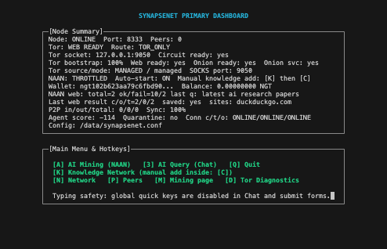
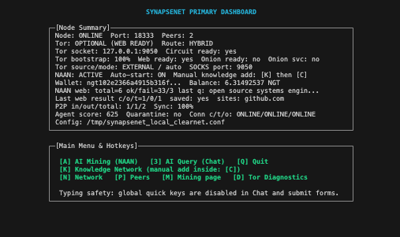

# SynapseNet 0.1.0-beta

<p align="center">
  <a href="https://github.com/KeplerSynapseNet/Synapsenetai/releases/tag/v0.1.0-beta"></a>
  <a href="LICENSE"></a>
  <a href="https://github.com/KeplerSynapseNet/Synapsenetai/actions"></a>
  <a href="https://github.com/KeplerSynapseNet/Synapsenetai/stargazers"></a>
</p>

<p align="center">
  <a href="https://isocpp.org"></a>
  <a href="https://cmake.org"></a>
  <a href="https://github.com/KeplerSynapseNet/Synapsenetai"></a>
  <a href="https://github.com/KeplerSynapseNet/Synapsenetai"></a>
  <a href="https://github.com/KeplerSynapseNet/Synapsenetai"></a>
</p>

<p align="center">
  <a href="http://vkqyb4cwfnybhcbz6sub7dhkhgn3vwxyxl7lt6uvdrzax6gaoaaxbxqd.onion"></a>
  <a href="https://www.blockchain.com/btc/address/bc1q5pkemq7q84ld4rf5kwtafp7jfl9dlf3pc4z9d4"></a>
  <a href="https://synapsenetai.org"></a>
</p>

**A Decentralized Intelligence Network**

> "Satoshi gave us money without banks. I will give you brains without corporations."  
> — Kepler

SynapseNet is a decentralized peer-to-peer network for collective intelligence. It is to **KNOWLEDGE** what Bitcoin is to **MONEY**. Mine with intelligence using Proof of Emergence (PoE).

## What is SynapseNet?

SynapseNet is a local-first AI network where nodes contribute and validate knowledge using deterministic consensus (PoE). The network is designed to be censorship-resistant, decentralized, and community-driven, with optional local AI chat and Web 4.0 context injection (clearnet/onion).

## What is NGT?

**NGT** is the native token of SynapseNet. You earn NGT by running a node and contributing knowledge to the network.

- Every node runs an AI agent (NAAN) that automatically searches the internet, creates verified knowledge entries, and submits them to the network.
- Validators vote on entries. Once finalized, the author earns NGT.
- No GPUs required. No staking required. Just run the node on any laptop.

Unlike Bitcoin mining (which burns energy on meaningless hashes), SynapseNet mining produces **real knowledge** stored in a decentralized network. Every NGT is backed by verified information.

## How Mining Works

```
1. NAAN Agent searches the internet (DuckDuckGo, Brave)
2. Creates a Research Draft with sources and citations
3. Draft passes Review Pipeline (intent, duplicates, PoW)
4. Submitted to Knowledge Network as a PoE Entry
5. Validators auto-vote → entry becomes FINALIZED
6. Epoch Rewards → NGT credited to your wallet every ~30 seconds
```

No manual action needed — just start the node and it mines automatically.

## Wallet Backup & Restore

When you first start SynapseNet, it creates a new wallet with a **24-word seed phrase**.

> **⚠ IMPORTANT:** Write down your seed phrase on paper. It is the ONLY way to recover your wallet. Do NOT store it digitally. Do NOT share it with anyone.

To **restore** an existing wallet on a fresh node:
1. Start the node (it will show the Welcome screen)
2. Press **`2`** — Import Wallet
3. Paste your 24-word seed phrase (words separated by spaces)
4. Press **Enter** — your wallet is restored

## Screenshots

<p align="center">
  
  
  
</p>


## Links

- **GitHub:** https://github.com/KeplerSynapseNet
- **Official:** https://synapsenetai.org
- **Onion:** http://vkqyb4cwfnybhcbz6sub7dhkhgn3vwxyxl7lt6uvdrzax6gaoaaxbxqd.onion

### Bitcoin
kepler
`bc1q5pkemq7q84ld4rf5kwtafp7jfl9dlf3pc4z9d4`

## Connecting to the SynapseNet Network

The SynapseNet seed node runs at `144.31.169.103:8333`. All clients automatically discover and connect to it via the hardcoded bootstrap list. You can also add it manually with `--addnode 144.31.169.103:8333`.

### macOS (Native Build)

```bash
# 1. Install dependencies
brew install cmake openssl@3 ncurses sqlite3

# 2. Clone the repository
git clone https://github.com/KeplerSynapseNet/Synapsenetai.git
cd Synapsenetai

# 3. Build
cmake -S KeplerSynapseNet -B build -DCMAKE_BUILD_TYPE=Release \
  -DOPENSSL_ROOT_DIR=$(brew --prefix openssl@3) \
  -DBUILD_TESTS=ON -DBUILD_IDE=OFF
cmake --build build -j$(sysctl -n hw.ncpu)

# 4. Create a config file (clearnet mode, no Tor)
cat > /tmp/synapsenet.conf << 'EOF'
agent.tor.required=false
agent.routing.allow_clearnet_fallback=true
agent.routing.allow_p2p_clearnet_fallback=true
force_clearnet_naan=true
naan_automining=true
poe.epoch.auto_enabled=true
skip_wizard=true
EOF

# 5. Run the node (daemon mode)
./build/synapsed -d \
  --config /tmp/synapsenet.conf \
  --datadir /tmp/synapsenet_data \
  --port 8333 \
  --addnode 144.31.169.103:8333

# 6. Check logs
cat /tmp/synapsenet_data/synapsenet.log
# You should see: "Peer connected: 144.31.169.103:8333"

# 7. Run with TUI (interactive mode)
TERM=xterm-256color ./build/synapsed \
  --config /tmp/synapsenet.conf \
  --datadir /tmp/synapsenet_data \
  --addnode 144.31.169.103:8333
```

### Ubuntu / Debian (Linux)

```bash
# 1. Install dependencies
sudo apt-get update
sudo apt-get install -y build-essential cmake git libssl-dev \
  libcurl4-openssl-dev libncurses-dev libncursesw5-dev libsqlite3-dev

# 2. Clone the repository
git clone https://github.com/KeplerSynapseNet/Synapsenetai.git
cd Synapsenetai

# 3. Build
cmake -S KeplerSynapseNet -B build -DCMAKE_BUILD_TYPE=Release \
  -DBUILD_TESTS=ON -DBUILD_IDE=OFF
cmake --build build -j$(nproc)

# 4. Create a config file
cat > /tmp/synapsenet.conf << 'EOF'
agent.tor.required=false
agent.routing.allow_clearnet_fallback=true
agent.routing.allow_p2p_clearnet_fallback=true
force_clearnet_naan=true
naan_automining=true
poe.epoch.auto_enabled=true
skip_wizard=true
EOF

# 5. Run the node (daemon mode)
./build/synapsed -d \
  --config /tmp/synapsenet.conf \
  --datadir /tmp/synapsenet_data \
  --port 8333 \
  --addnode 144.31.169.103:8333

# 6. Check logs
cat /tmp/synapsenet_data/synapsenet.log

# 7. Run with TUI (interactive mode)
TERM=xterm-256color ./build/synapsed \
  --config /tmp/synapsenet.conf \
  --datadir /tmp/synapsenet_data \
  --addnode 144.31.169.103:8333
```

### Docker

```bash
# 1. Clone the repository
git clone https://github.com/KeplerSynapseNet/Synapsenetai.git
cd Synapsenetai

# 2. Build and run with Docker Compose (recommended)
COMPOSE_MENU=false docker compose up --build

# 3. Or build and run manually
docker build -f KeplerSynapseNet/Dockerfile -t keplersynapsenet:local KeplerSynapseNet
docker run --rm -it \
  -p 8332:8332 -p 8333:8333 \
  -e SYNAPSENET_ADDNODE=144.31.169.103:8333 \
  -e SYNAPSENET_PRIVACY=false \
  -e SYNAPSENET_DAEMON=false \
  keplersynapsenet:local

# 4. Health check
docker compose exec -T synapsenet /app/synapsed status -D /data

# 5. Stop
docker compose down
```

### Useful Commands

```bash
# Check node status
./build/synapsed status --datadir /tmp/synapsenet_data

# List connected peers
./build/synapsed peers --datadir /tmp/synapsenet_data

# Show wallet balance
./build/synapsed balance --datadir /tmp/synapsenet_data

# Show wallet address
./build/synapsed address --datadir /tmp/synapsenet_data

# Search the knowledge network
./build/synapsed query "quantum computing" --datadir /tmp/synapsenet_data

# Stop the daemon
kill $(cat /tmp/synapsenet_data/synapsed.lock | head -1)
```

### Network Ports

| Port | Protocol | Description |
|------|----------|-------------|
| 8333 | TCP | P2P network (peer discovery, block relay) |
| 8332 | TCP | JSON-RPC API |

### Seed Node

| Host | Port | Location |
|------|------|----------|
| `144.31.169.103` | 8333 | Finland |

---

## Quick Start

```bash
TERM=xterm-256color ./build/synapsed -D /tmp/synapsenet_dev --dev --addnode 144.31.169.103:8333
```

For external Tor (`9150`) bridge mode and startup troubleshooting, see `KeplerSynapseNet/README.md` and:
- `KeplerSynapseNet/docs/tor_shared_external_9150_runbook.md`
- `KeplerSynapseNet/docs/tor_9050_9150_conflict_runbook.md`

## Shared Tor 9150 (No-Conflict Launch Sequence)

Use one Tor runtime on `127.0.0.1:9150` and share it across SynapseNet + Tor Browser.

```bash
# 1) Stop extra Tor owners (optional but recommended before restart)
pkill -f "/Applications/Tor Browser.app/Contents/MacOS/Tor/tor" || true
pkill -f "/opt/homebrew/bin/tor" || true
sleep 1
```

```bash
# 2) Start external bridge Tor on 9150
cd <repo-root>/KeplerSynapseNet
tools/macos_tor_obfs4_helper.sh \
  --bridges-file /tmp/bridges.txt \
  --socks-port 9150 \
  --control-port 9151 \
  --bootstrap-check \
  --bootstrap-attempts 6 \
  --bridge-subset-size 4 \
  --takeover-port-owner \
  --keep-running \
  --out /tmp/tor-obfs4-synapsenet.conf
```

```bash
# 3) Verify Tor path
lsof -nP -iTCP:9150 -sTCP:LISTEN
curl --socks5-hostname 127.0.0.1:9150 https://check.torproject.org/api/ip --max-time 30
```

```bash
# 4) Run SynapseNet using external Tor snippet
cd <repo-root>/KeplerSynapseNet
TERM=xterm-256color ./build/synapsed \
  -D /tmp/synapsenet_fresh \
  --dev \
  -c /tmp/synapsenet_external_9150.conf
```

```bash
# 5) Run Tor Browser as SOCKS client of the same Tor
TOR_PROVIDER=none TOR_SOCKS_HOST=127.0.0.1 TOR_SOCKS_PORT=9150 \
"/Applications/Tor Browser.app/Contents/MacOS/firefox" --new-instance
```

Important:
- Do not run plain `tor` manually after this (it starts another instance, usually on `9050`).
- If helper reports `9150 already in use` and the curl probe returns `"IsTor":true`, keep the current Tor process and continue.

## NAAN Site Allowlist (TUI)

You can configure what sites NAAN is allowed to use directly from the SynapseNet interface:

1. Open `Settings`.
2. Press `W` (`NAAN Site Allowlist (clearnet/onion)`).
3. Choose list target:
   - `C` for `clearnet_site_allowlist`
   - `O` for `onion_site_allowlist`
4. Enter one rule per line, press `Enter` to add.
5. Press `Enter` on an empty line to save and exit.

Config file path shown in the UI:
- `<DATA_DIR>/naan_agent_web.conf`

Security note:
- You are responsible for any site you add.
- Malicious sites can deliver phishing, exploit payloads, and malware.
- Use endpoint protection (AV/EDR), sandboxing/VMs, and least privilege.
- IDE/AI tools can help triage logs and suspicious behavior, but they do **not** replace antivirus/EDR.
- If you use cloud/LLM analysis, share sanitized logs only (no keys/secrets/private data).

## Build

### CI

GitHub Actions runs:
- Linux + macOS build + tests (llama.cpp OFF for speed)
- Linux build with llama.cpp
- Windows build + tests (MSYS2)
- Docker build (tests run during image build)

Common requirements:
- CMake 3.16+
- C++17 compiler
- ncurses (required)
- SQLite3 (optional but recommended)
- Go (optional, only if you want the terminal Synapse IDE)

### Linux

```bash
sudo apt-get update
sudo apt-get install -y build-essential cmake git libncurses-dev libsqlite3-dev

cmake -S KeplerSynapseNet -B build -DCMAKE_BUILD_TYPE=Release -DUSE_LLAMA_CPP=OFF -DBUILD_TESTS=ON
cmake --build build --parallel
ctest --test-dir build --output-on-failure
```

### macOS

```bash
brew install cmake ncurses sqlite3

cmake -S KeplerSynapseNet -B build -DCMAKE_BUILD_TYPE=Release -DUSE_LLAMA_CPP=OFF -DBUILD_TESTS=ON
cmake --build build --parallel
ctest --test-dir build --output-on-failure
```

### Windows

Windows users should use **Docker** to run SynapseNet. See the [Docker](#docker) section above.

### Docker (Windows/macOS/Linux fallback)

This builds **Linux** binaries inside a container (useful on Windows when WSL2 is not available or fails).
Runtime image includes Tor tooling (`tor`, `tor-geoipdb`, `obfs4proxy`).

`docker-compose.yml` runs two services:
- `tor`: external Tor SOCKS endpoint on the Docker network
- `synapsenet`: starts in privacy mode and forces `agent.tor.mode=external` to use `tor:9050`

```bash
docker build -f KeplerSynapseNet/Dockerfile -t keplersynapsenet:local KeplerSynapseNet
# or multi-arch
# docker buildx build --platform linux/amd64,linux/arm64 -t keplersynapsenet:local --load .

# single-container run (no sidecar Tor; mainly for debugging)
docker run --rm -it -p 8332:8332 keplersynapsenet:local

# or via Docker Compose (recommended for repeat runs)
COMPOSE_MENU=false docker compose up --build
# next runs (without rebuild)
COMPOSE_MENU=false docker compose up
# background mode
# docker compose up -d
# stop and remove
# docker compose down
```

### Docker TUI + Tor Notes

- `[Q]` in TUI is a normal app exit and returns you to shell.
- If attached to the container and you want to leave it running, use `Ctrl+P`, then `Ctrl+Q`.
- If Docker Compose shows TTY/menu glitches (`Error while reading terminfo data: EOF`), run with `COMPOSE_MENU=false`.
- Quick health check:

```bash
docker compose exec -T synapsenet /app/synapsed status -D /data
docker compose exec -T synapsenet /app/synapsed tor status -D /data
```

- Exit codes:
  - `Exited (0)` -> normal quit (often `[Q]`)
  - `Exited (139)` -> process crashed (segfault)

Expected Tor status in Docker Compose:
- `torRuntimeMode = external`
- `torSocksHost = tor`
- `torSocksPort = 9050`
- `torBootstrapState = WEB_READY`

Reset all persisted data (destructive: wallet/node data in Docker volume):

```bash
docker compose down -v
```

## Project Structure

| Directory | Description |
|-----------|-------------|
| `KeplerSynapseNet/` | Core daemon, TUI, AI model integration, P2P network |
| `ide/synapsenet-vscode/` | VS Code extension for Synapse IDE |
| `interfaces txt/` | Architecture specs, design documents |
| `pictures/` | Project assets |

Documentation source of truth: edit only `Synapsenet-main/interfaces txt`; `Synapsenet-main/KeplerSynapseNet/interfaces txt` is a CI mirror.

## Features

- **Local AI Chat** — Run GGUF models locally, stream tokens in real time
- **Proof of Emergence (PoE)** — Contribute knowledge, validate, earn NGT
- **Web 4.0** — Optional clearnet/onion search injection (F5/F6/F7)
- **Quantum-resistant crypto** — CRYSTALS-Dilithium, Kyber, SPHINCS+
- **Synapse IDE** — Terminal IDE + VS Code extension for AI-assisted coding

## License

MIT License. See [LICENSE](LICENSE).

## Contributing

Everyone is welcome to contribute and improve SynapseNet. See [CONTRIBUTING.md](CONTRIBUTING.md) for guidelines and consensus rules.
